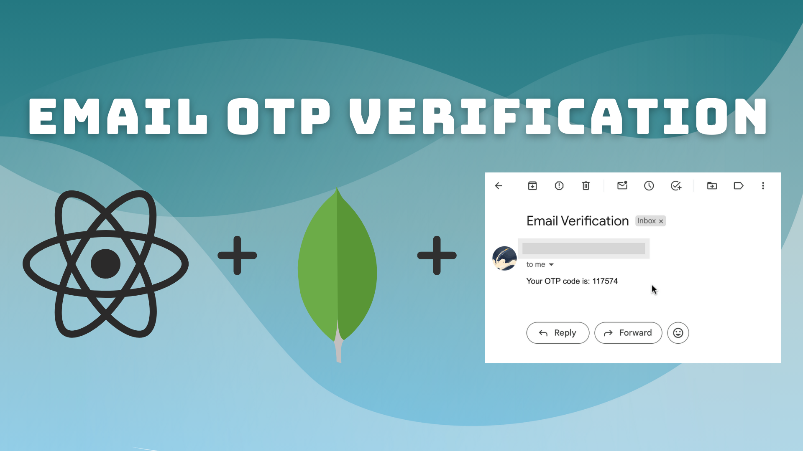

# Email OTP verification

## Getting started



To get started with this project, run

```bash
git clone https://github.com/Vishakha-Sawra/react-otp-generate.git
```

and copy the .env.example variables present in the server folder into a separate .env file, fill them out & and then Navigate to the server folder:

```bash
  cd server
```

And run the command **npm start** to start the server, and it will run on localhost:4000

```bash
  npm start
```

Then in the root folder run the command  npm run dev to start the frontend part of this application and it will start on: http://localhost:5173/

```bash
  npm run dev
```

And that's all you need to run this entire application.  